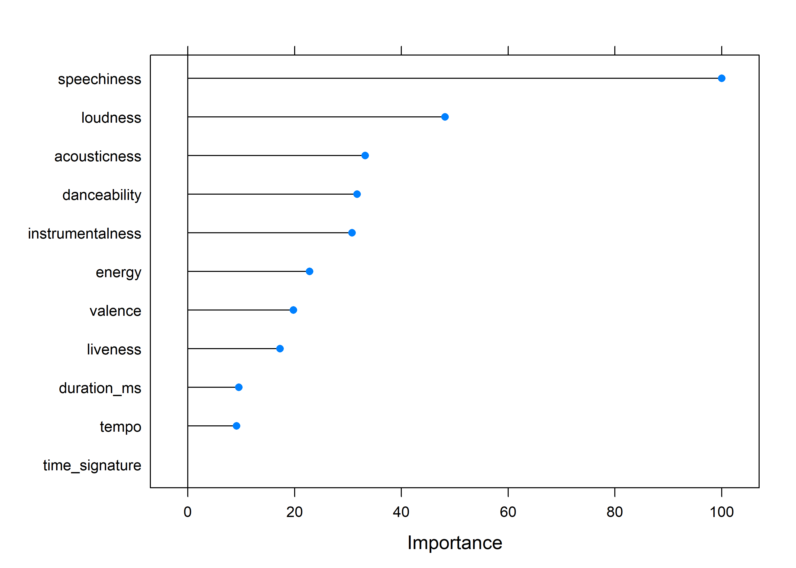

# Music Classification using Machine Learning

The [Spotify API](https://developer.spotify.com/documentation/web-api/) lets developers get many features describing any song. These features are generated automatcally for songs (i.e., are not generated by humans). These features include:

* danceability
* energy
* loudness
* speechiness
* acousticness
* instrumentalness
* liveness
* valence
* tempo
* time_signature
* duration

 

### Building the data

On the surface, these variables seem meaningful, but I wanted to determine if they actually could be used to discriminate between different generes of music using machine learning methods. First, I tested to see if machine learning classification models could be used to classify two extremely different genres of music -- rap and folk.

I used the Spotify API to get the top 50 rap and folk artists and compiled them into a dataset and then used the same API to get all the data for those 100 artists. The dataset contains 24,830 songs (9810 rap songs and 15,020 folk songs).

 

### Data Visualizaiton

I looked at distribution of values for each variable colored by genre:

Some of these variables show that they can be used to discriminate between genres of music. As an example, dancibility shows that rap is quite a bit more dancable than folk.

We can also use Principal Components Analysis (or other dimension reduction methods) to visiualize the 11 dimensional space in two dimensions:

As we can see, these two genres are largely non-overlapping, showing good possibility of being classified correctly using machine learning models.

 

### Data partitioning 

I split the data 80-20 into a training and test set. I used the training set to train the models and get some estimate of how well they could classify novel songs correctly. I used the test set to make sure the model's actually had the ability to classify novel data they hadn't been trained on.

 

### Classification

I used five different machine learning classification models to see if these variables can be used to classify a song's genre:

* Random Forest 
* Support Vector Machine
* Artificial Neural Network
* Naive Bayes
* k Nearest Neighbors

I used 10 fold cross validation and the mean results along with their 95% confidence intervals are here:

As we can see, the random forest model performed best with over 95% accuracy. The worst performing model was the k Nearest Neighbors, with les than 75% accuracy. Notably, the neural network model performed well, but had significantly more variance in performance than any other model.

Given that the random forest model was best, we can also take a look at the confusion matrix for the random forest model:

|               |               | Reference |    |
| ------------- |-------------| -----| -----|
|               |         | folk   | rap   |
| Prediction    | folk    |   59.2 |   2.4 |
|               | rap     |    1.2 |    37.2 |

 

### Variable importance

I used the random forest model to determine variable importance:

These show a fairly consistent story as the density plots presented above did. Some variables like speechniness and loudness are important variables, whereas other variables like tempo do not allow to discriminate between genres.

 

## Including more music genres

I have shown that the Spotify variables do indeed capture important information about a song's genre. I have also shown that machine learing models can be used to correctly classify rap versus folk music. Having done this I know will use more music genres:

* rap
* folk
* rock
* electronic
* jazz

 

### Data visulazation

Again, I looked at distribution of values for each variable colored by genre (now five different genres):

Again, the same variables show that they may be able to help to discriminate between genres of music.

We can again use Principal Components Analysis to visiualize the 11 dimensional space in two dimensions:

Things obviously get messier with five different genres, but we can see a lot of structure, even in just two dimensions.

 

### Data partitioning and classification

I used the same five machine learning models and 10 fold cross validation:

Again, the random forest model performed best. However, as we would expect with five classes, the model performs less well than the over 95% accuracy it did with only two classes. Notably, the neural network model performed worst, and had significantly more variance in performance than any other model.

Given that the random forest model was best again, we can also take a look at the confusion matrix for the random forest model:

|               |               | Reference     |
| ------------- |-------------| -----| -----| -----| -----| -----|
|               |               | electronic   | folk   |  jazz   | rap   | rock |
|               | electronic    |   17.0       |   0.7  |   0.8   |    0.8 |      1.7 |
|               | folk          |    0.3       |   12.4 |   2.8    |   0.7    |   4.0  |
| Prediction    | jazz          |    0.4       |   2.9  |  15.0   |    0.4 |      1.7 |
|               | rap           |    1.1       |   0.5  |   0.5    |  17.4    |   0.8  |
|               | rock          |    1.2       |   3.3  |  1.0   |    0.7 |     12.0 |

 

### Summary

This analysis shows that the automated variables from the Spotify API allow for the meaningful differentiation of genre using machine learning methods. While not all variables proved useful in this task, these variables could be useful for other analyses, such as a within-artists analysis to look at the range of music produced by particular aritsts. 

 
 
 

